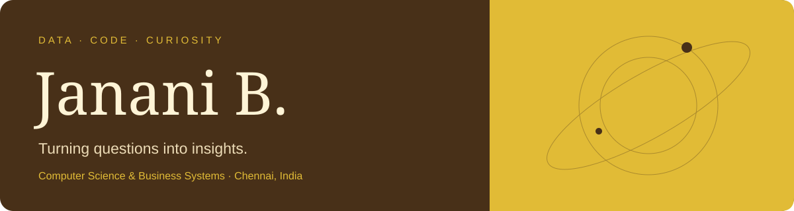

  

  <a href="https://github.com/Janani-Balasubramanian/portfolio">Portfolio</a> ·
  <a href="https://www.linkedin.com/in/janani-balasubraminan-81679b32b">LinkedIn</a> ·
  <a href="mailto:jananibalasubraminan@gmail.com">Email</a>

## Hello, I'm Janani

I'm a **pre-final-year Computer Science and Business Systems student** at Rajalakshmi Institute of Technology, Chennai. I explore how data and software can make everyday systems more useful, understandable, and reliable.

My work spans Python-based analysis, SQL databases, and web applications. I'm currently seeking a **data analytics internship** where I can turn real-world questions into clear insights.

### What I work with

| Area | Technologies & skills |
| --- | --- |
| Data analysis | Python, Pandas, NumPy, exploratory data analysis, data cleaning |
| Databases | SQL, MySQL, joins, aggregations, stored procedures |
| Visualization | Matplotlib, Seaborn; foundational Tableau and Power BI |
| Development | Java, C, HTML, CSS, basic JavaScript, Git |
| Exploring | Regression, classification, scikit-learn basics, API integration |

### Selected work

**IPR Student Portal** · First prize, Designathon 2026 at RIT  
A student-facing platform to register, track, and manage intellectual property filings. User research helped simplify the filing journey from six steps to two.

**Medical Management System** · Python / SQL  
A relational database and web dashboard for patient records, data validation, and reporting.

**Bus Attendance System** · Python / Pandas / SQL  
An attendance pipeline and dashboards for ridership trends, utilization, and weekly summaries.

**Eventify** · Python / SQL  
An event management platform exploring personalized discovery through user behavior analysis.

**Jarvis Voice Assistant** · Python / SpeechRecognition / pyttsx3  
A modular voice assistant for search, weather, application launching, and everyday automation.

### Beyond the classroom

At **India Space Academy** in June–July 2025, I analyzed mid-infrared spectral cubes from NASA's **JWST MIRI** instrument for the active galaxy **NGC 7469**. The experience strengthened my interest in scientific data, signal extraction, and the questions hidden inside complex datasets.

- **First prize** — RIT Designathon 2026
- **Data Science with Python** — Let's Upgrade, 2025
- **SQL Programming** — Mind Luster, 2025
- Participant — Syntex 2.0, EY Techathon 6.0 Round 1, and AMD Slingshot Campus Days

---

**Let's build something useful.** I'm open to data analytics internships and thoughtful project collaborations.
